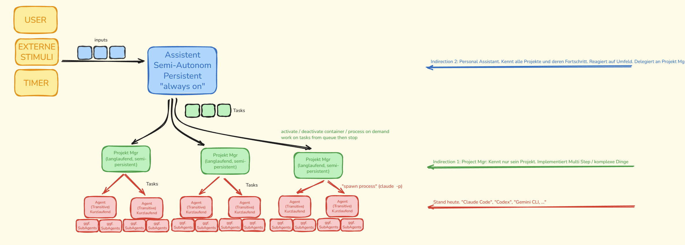

Hier ist die konsolidierte Zusammenfassung unseres Architektur- und Forschungsplans für das Projekt **"Autonomous Coding Swarm"**.

Dieses Dokument dient als **Context-Anchor** für zukünftige Sessions. Es beschreibt die Vision, die Architektur, die technischen Entscheidungen sowie die Implementierungsstrategie für Phase 1.



-----

# Design-Dokument: Autonomous AI Coding Architecture (Research Project)

## 1\. Vision & Problemstellung

**Status Quo:** Der Entwickler (User) arbeitet an drei Software-Projekten gleichzeitig. Der Engpass ist nicht mehr die Fähigkeit der KI, Code zu schreiben, sondern die Wartezeit auf die Generierung und die menschliche Orchestrierung.
**Ziel:** Maximale Parallelisierung der Entwicklungsarbeit. Ein System soll geschaffen werden, das autonom im Hintergrund an Aufgaben arbeitet (24/7), während der User die strategische Führung behält.
**Kern-Metrik:** Reduktion der "Idle Time" des Users und Erhöhung des Durchsatzes durch asynchrone, autonome Agenten.

## 2\. Das 3-Schichten-Modell (The Layered Architecture)

Wir unterteilen das System in drei logische Ebenen mit strikter Aufgabentrennung:

### 🔵 Blue Layer: "The Executive / Interface"

  * **Rolle:** User Interface & High-Level Monitoring (CEO-Dashboard).
  * **Tech:** Next.js Web Application.
  * **Aktueller Status:** Blau = User (noch keine eigene KI-Intelligenz)
  * **Funktion:**
      * Erlaubt dem User, "Ideen" oder "Epics" einzukippen (z.B. "Implementiere Gamification Features 1-20").
      * Visualisiert den Status aller Projekte und Tasks.
      * Ermöglicht manuelle Eingriffe (Priorisierung, Stop-Button).
  * **Zukunftsvision:** Blau wird eigenständig und kann, wenn Grün "idle" ist (alles abgearbeitet, kein User-Input), proaktiv die Arbeit vorantreiben.
  * **Kommunikation:** Schreibt Ziele in die zentrale Datenbank.

### ⚙️ Spawning Engine: "The Only Persistent Process"

  * **Rolle:** Einziger dauerhaft laufender Prozess. Pollt Task-Queue, spawnt K8s Jobs.
  * **Architektur:** Singleton, "always on", Deployment (kein Job).
  * **Funktion:**
      * Pollt `tasks` Tabelle auf `status = 'pending'`
      * Prüft pro Adressat: Läuft schon ein Job? → Skip (Sequenzierung)
      * Spawnt K8s Job mit Task-Parametern
      * Aktualisiert Task-Status auf `running`
      * Reagiert auf Events (Job-Completion) und setzt Status auf `completed`
  * **Wichtig:** Agenten wissen nichts über K8s. Sie legen nur Tasks an. Die Engine ist die einzige Brücke zur Infrastruktur.

### 🟢 Green Layer: "The Project Manager"

  * **Rolle:** Strategische Planung & Orchestrierung pro Projekt.
  * **Architektur:** **Ephemer wie Rot!** Wird als K8s Job gespawnt, erledigt Aufgabe, stirbt.
  * **Tech:** Docker Container mit Claude Code CLI (wie Rot).
  * **Funktion:**
      * Wird aktiviert wenn: (a) neues Epic von Blau kommt, (b) ein Rot-Task abgeschlossen wurde
      * **Iterative Planung:** Kein "Big Upfront Plan"! Schreibt groben Plan in `.ai/plan.md`, extrahiert immer nur den/die nächsten Task(s)
      * Entscheidet bei jedem Aufruf neu: Was ist der nächste Schritt basierend auf aktuellem Stand?
      * Spawnt Tasks (Implement, Review, Test, Merge) - **alles sind normale Tasks mit unterschiedlichen Prompts**
      * Führt Retry-Count um Endlosschleifen zu vermeiden
  * **Wichtig:** Hält den Plan im Repository (`.ai/plan.md`), nicht in der Datenbank. Single Source of Truth.
  * **Quality Gates:** Sind normale Rot-Tasks! Grün entscheidet ob Review/Test-Task nötig ist.
  * **Statische Checks:** Linting, Tests laufen in Git Commit Hooks (erzwungen). Zusätzliche Gates in GitHub Actions.

### 🔴 Red Layer: "The Worker"

  * **Rolle:** Exekutive Umsetzung (Coding).
  * **Architektur:** Ephemere (kurzlebige) Kubernetes Jobs. Starten -\> Arbeiten -\> Beenden.
  * **Tech:** Docker Container mit **Claude Code CLI** (Headless Mode).
  * **Funktion:**
      * Erhält genau *einen* Task.
      * Klont das Repo, erstellt einen Feature-Branch.
      * Führt die Änderung durch (Coding, Testing).
      * Pusht den Code und meldet Erfolg/Misserfolg zurück.

-----

## 2.1 Orchestrierung & Task Spawning (Das "Außen-Konstrukt")

Die Agenten (Grün & Rot) spawnen **niemals** selbst Kubernetes-Jobs. Sie haben nur ein Tool: **Tasks anlegen**. Eine zentrale **Spawning Engine** ist der einzige Prozess, der K8s-Jobs startet.

### Die Spawning Engine

```
┌─────────────────────────────────────────────────────────────┐
│                    SPAWNING ENGINE                          │
│  (Singleton, "always on", pollt die Task-Queue)            │
├─────────────────────────────────────────────────────────────┤
│  FOR EACH task IN queue WHERE status = 'pending':          │
│    IF task.addressee IS running:                           │
│      SKIP (sequenzielle Abarbeitung für diesen Adressaten) │
│    ELSE:                                                   │
│      SPAWN K8s Job                                         │
│      SET task.status = 'running'                           │
└─────────────────────────────────────────────────────────────┘
```

### Das Adressaten-Prinzip

Jeder Task hat einen **Adressaten** (beliebiger String). Dieser bestimmt die Parallelisierung:

| Adressat | Verhalten | Beispiel |
|----------|-----------|----------|
| `project-mgr-email-sync` | Sequenziell (nur 1 Job gleichzeitig) | Grüner PM für email-sync Projekt |
| `project-mgr-webapp` | Sequenziell (nur 1 Job gleichzeitig) | Grüner PM für webapp Projekt |
| `worker-{uuid}` | Parallel (jeder Worker ist einzigartig) | Rote Worker-Tasks |

**Wichtig:** Es gibt keinen Status "Waiting" oder "Blocked". Wenn ein Task existiert, kann er bearbeitet werden. Die Sequenzierung ergibt sich allein durch den Adressaten.

### Workflow: Iterative Task-Schleife

```
┌─────────────────────────────────────────────────────────────────────────┐
│                         SPAWNING ENGINE (always on)                     │
│                    pollt Queue, spawnt Jobs, tracked Status             │
└────────────────────────────────┬────────────────────────────────────────┘
                                 │
     ┌───────────────────────────┼───────────────────────────┐
     │                           │                           │
     ▼                           ▼                           ▼
┌─────────┐               ┌─────────────┐             ┌─────────────┐
│  BLAU   │──Epic──────▶  │    GRÜN     │──Task────▶  │     ROT     │
│ (User)  │               │ (Proj.Mgr)  │             │  (Worker)   │
└─────────┘               └──────┬──────┘             └──────┬──────┘
                                 │                           │
                                 │◀────Result────────────────┘
                                 │
                          Iteriert bis fertig
```

**Iterativer Ablauf (Grün-Perspektive):**

1. **Trigger:** Grün wird aktiviert (Epic von Blau ODER Rot-Task abgeschlossen)
2. **Kontext laden:** Liest `.ai/plan.md` aus Repo, prüft aktuellen Stand
3. **Entscheiden:** Was ist der nächste Schritt?
   - Implement-Task? → Spawnt Rot mit Coding-Prompt
   - Review nötig? → Spawnt Rot mit Review-Prompt (= Quality Gate)
   - Merge ready? → Spawnt Rot mit Merge-Prompt
   - Alles fertig? → Meldet "Epic complete"
   - Zu viele Retries? → Gibt auf, meldet Failure
4. **Plan aktualisieren:** Schreibt aktuellen Stand in `.ai/plan.md`, committet
5. **Task(s) anlegen:** Nur die nächsten, nicht den ganzen Plan!
6. **Beenden:** Grün stirbt, Spawning Engine übernimmt

**Wichtig: Quality Gates sind normale Tasks!**

```
Grün entscheidet:              Spawnt Task mit Prompt:
─────────────────              ──────────────────────
"Brauche Implementation"   →   "Implementiere Feature X auf Branch Y..."
"Brauche Review"           →   "Reviewe die Änderungen auf Branch Y..."
"Brauche Tests"            →   "Führe Tests aus für Branch Y..."
"Kann mergen"              →   "Merge Branch Y nach main..."
```

Statische Checks (Linting, Unit Tests) laufen automatisch in:
- Git Commit Hooks (erzwungen, vor Push)
- GitHub Actions (können Merge blockieren)

### Design-Prinzipien

| Prinzip | Begründung |
|---------|------------|
| **Nur die Engine ist persistent** | Grün + Rot sind ephemer. Vereinfacht Debugging, keine Zombie-Prozesse. |
| **Agenten spawnen keine Jobs** | Separation of Concerns. Agenten wissen nichts über K8s. |
| **Kein Blocked/Waiting Status** | Vereinfacht das Datenmodell. Sequenz über Adressat. |
| **Ein Task = Ein Branch** | Isolation. Keine Merge-Konflikte während der Arbeit. |
| **Keine Konversation** | Ein Shot. Entweder es klappt oder nicht. |
| **Iterative Planung** | Grün plant nur den nächsten Schritt, nicht alles voraus. Vermeidet starre Pläne. |
| **Quality Gates = Tasks** | Kein spezieller Prozess. Review/Test sind normale Rot-Tasks mit anderem Prompt. |
| **Grün hält den Plan** | Single Source of Truth im Repo (`.ai/plan.md`), nicht in DB. |
| **Retry-Count** | Verhindert Endlosschleifen. Nach N Fehlschlägen gibt Grün auf. |

-----

## 3\. Technische Kern-Entscheidungen & Rationale

### A. Infrastruktur: Kubernetes & Docker

  * **Entscheidung:** Wir nutzen einen eigenen Kubernetes-Cluster.
  * **Grund:** Wir benötigen strikte Isolation. Jeder "Red Agent" muss in einer sauberen Umgebung starten, um State-Pollution (z.B. veränderte Files, Prozess-Leichen) zu verhindern. Docker-Container als "Wegwerf-Umgebungen" garantieren, dass jeder Task bei Null beginnt.

### B. State Management: Datenbank statt Message Queue

  * **Entscheidung:** PostgreSQL als zentrale Queue und State-Store. Kein Kafka/RabbitMQ in Phase 1.
  * **Grund:** Persistenz und Debugging. Wir müssen jederzeit sehen können, warum ein Task vor 4 Stunden fehlgeschlagen ist. Eine relationale DB erlaubt einfaches Monitoring und manuelles "Rescheduling" durch Ändern eines Status-Feldes.

### B.1 Task-Datenmodell (Minimalistisch)

```sql
CREATE TABLE tasks (
    id              UUID PRIMARY KEY DEFAULT gen_random_uuid(),

    -- Adressat bestimmt Parallelisierung
    -- Gleicher Adressat = sequenziell, verschiedene = parallel
    addressee       VARCHAR(255) NOT NULL,

    -- Nur 3 Stati: pending, running, completed
    status          VARCHAR(50) DEFAULT 'pending',

    -- Was soll getan werden?
    prompt          TEXT NOT NULL,

    -- Kontext für den Task
    repo_url        TEXT,
    branch          VARCHAR(255),

    -- Wer hat den Task erstellt? (für Rückmeldung)
    created_by      VARCHAR(255),

    -- Timestamps
    created_at      TIMESTAMP DEFAULT NOW(),
    started_at      TIMESTAMP,
    completed_at    TIMESTAMP,

    -- Ergebnis (JSON für Flexibilität)
    result          JSONB,
    -- Beispiel: {"success": true, "commit_sha": "abc123", "branch": "feature/xyz"}
    -- Beispiel: {"success": false, "error": "Tests failed", "logs": "..."}

    -- Welcher K8s Job hat das bearbeitet?
    worker_pod      VARCHAR(255)
);

-- Index für die Spawning Engine (häufigste Query)
CREATE INDEX idx_tasks_pending ON tasks(addressee, status) WHERE status = 'pending';
CREATE INDEX idx_tasks_running ON tasks(addressee) WHERE status = 'running';
```

**Kernprinzip:** Das Datenmodell ist absichtlich minimal. Keine Abhängigkeiten, keine Prioritäten, kein "Blocked"-Status. Die Intelligenz liegt in den Agenten, nicht in der Queue.

### C. Tooling: Claude Code CLI (Headless)

  * **Entscheidung:** Wir nutzen das CLI-Tool `claude` im `-p` (print/headless) Modus, statt die API direkt via SDK anzusprechen.
  * **Grund:** Das CLI-Tool bietet mächtige "Out-of-the-Box" Funktionen wie RAG (Retrieval Augmented Generation), File-Search und automatische Syntax-Checks, die wir sonst mühsam nachbauen müssten.

### D. Authentifizierung & Kostenkontrolle (Kritisch)

  * **Problem:** API-Calls kosten pro Token. Die "Claude Max" Subscription bietet eine Flatrate, ist aber primär für interaktive Nutzung gedacht.
  * **Entscheidung:** Wir zwingen die Container in den Subscription-Mode.
  * **Mechanismus:**
      * Wir verhindern das Setzen von `ANTHROPIC_API_KEY` (da dies API-Billing erzwingt).
      * Wir nutzen `CLAUDE_CODE_OAUTH_TOKEN` oder mounten das `~/.claude` Verzeichnis, um die Subscription-Credentials in den Container zu injizieren.
      * Wir implementieren einen "Safety-Check" im Start-Skript, der abbricht, wenn API-Billing erkannt wird.

-----

## 4\. Implementierungsplan Phase 1: Der "Red Agent" Prototyp

Unser erster Schritt ist "Bottom-Up". Wir validieren, ob wir einen Docker-Container bauen können, der *einen* Coding-Task autonom erledigt.

### Das Dockerfile (Entwurf)

Basis ist ein Node-Image, das `git`, `bash` und das `claude-code` CLI enthält. Es läuft unter einem non-root User (`aiworker`) für Sicherheit.

```dockerfile
FROM node:20-slim
RUN apt-get update && apt-get install -y git bash curl jq && rm -rf /var/lib/apt/lists/*
RUN npm install -g @anthropic-ai/claude-code
WORKDIR /app
RUN groupadd -r aiworker && useradd -r -g aiworker aiworker
RUN mkdir -p /home/aiworker/.claude && chown -R aiworker:aiworker /home/aiworker
COPY entrypoint.sh /app/entrypoint.sh
RUN chmod +x /app/entrypoint.sh
USER aiworker
ENV HOME=/home/aiworker
ENTRYPOINT ["/app/entrypoint.sh"]
```

### Das Entrypoint-Skript (Logic & Auth Guard)

Dieses Skript steuert den Lebenszyklus eines Jobs:

1.  **Safety Check:** Prüft, ob `ANTHROPIC_API_KEY` gesetzt ist -\> **ABBRUCH** (Schutz vor Kostenfalle).
2.  **Auth Injection:** Prüft auf `CLAUDE_CODE_OAUTH_TOKEN` (Env) oder `.claude` (Mount).
3.  **Setup:** Klont das Repo (oder nutzt Mount), checkt Branch aus.
4.  **Execution:** Startet `claude -p "TASK"` im Headless Mode.
5.  **Completion:** Prüft auf Änderungen, committet und pusht.

<!-- end list -->

```bash
#!/bin/bash
set -e

# --- KOSTEN- UND AUTH-CHECK ---
if [ -n "$ANTHROPIC_API_KEY" ]; then
    echo "❌ CRITICAL: ANTHROPIC_API_KEY detected! Aborting to prevent pay-per-token usage."
    exit 1
fi

if [ -z "$CLAUDE_CODE_OAUTH_TOKEN" ] && [ ! -d "$HOME/.claude" ]; then
    echo "❌ ERROR: No Subscription Auth found (Token or Mount needed)."
    exit 1
fi

# --- WORKFLOW ---
# 1. Repo Setup (Clone/Mount)
# 2. Branch Checkout
# 3. Claude Headless Execution:
#    claude -p "$TASK_PROMPT" --dangerously-skip-permissions
# 4. Git Push bei Erfolg
```

## 5\. Nächste Schritte (Historie)

### Ursprünglicher Plan (Phase 1)

1.  **Lokal:** Extraktion des OAuth-Tokens aus der lokalen Config (`cat ~/.claude/.credentials.json`). ✅
2.  **Test:** Bauen und Starten des Docker-Containers mit einem einfachen Task. ✅ (Docker lokal funktioniert)
3.  **Ausblick:** Sobald der Container ("Red Agent") stabil läuft, entwickeln wir den "Green Layer", der diese Container orchestriert.

-----

## 6\. Next Steps - Stand 2025-11-29

### Was heute erreicht wurde

- ✅ Docker-Container lokal getestet (funktioniert)
- ✅ Base-Image mit Node.js 25, Python 3.13, .NET 9, Claude Code CLI
- ✅ K8s Secrets konfiguriert (`coding-swarm-secrets` mit OAuth + GitHub Token)
- ✅ UID 1000 Fix für K8s SecurityContext (usermod statt neuer User)
- ✅ Architektur-Dokument erweitert (Spawning Engine, Adressaten-Konzept, iterative Planung)
- 🔄 Image-Push läuft (langsames Upstream, ~2 MBit)

### Nächste Session: Red Layer validieren

**Schritt 1: K8s Permission Test**
```bash
kubectl apply -f spike-01-container/k8s/job.yaml
kubectl logs -f -n coding-swarm job/red-agent-spike
```
- Erwartung: Container startet, Claude Code läuft, keine Permission-Fehler mehr
- Test-Task: Repo klonen + beschreiben (wie im Docker-Test)

**Schritt 2: Mini Coding Task mit Git-Workflow**
- Prompt: "Erstelle eine neue Datei `test.md` mit Inhalt, committe und pushe auf einen neuen Branch"
- Erwartung: Branch erscheint auf GitHub
- Bonus: PR erstellen lassen via `gh pr create`

→ Wenn das funktioniert: **Red Layer ist validiert.**

### Danach: Spawning Engine bauen

**Schritt 3: PostgreSQL deployen**
```yaml
# Option: Postgres in K8s oder externe DB
# Tabelle: tasks (wie im Datenmodell oben definiert)
```

**Schritt 4: Spawning Engine implementieren**
- Singleton-Deployment (kein Job)
- Pollt `tasks` Tabelle
- Prüft pro Adressat: Läuft Job? → Skip
- Spawnt K8s Job mit Task-ID als Parameter
- **Entrypoint.sh** lädt Task-Details aus DB (Prompt, Repo, Branch)

```
┌──────────────┐     ┌──────────────┐     ┌──────────────┐
│   Spawner    │────▶│  K8s Job     │────▶│   Agent      │
│ (Deployment) │     │  (Task-ID)   │     │ (lädt Task)  │
└──────────────┘     └──────────────┘     └──────────────┘
```

**Schritt 5: Minimales UI**
- Ziel: Übersicht über Tasks und deren Status
- Tech: Einfache Web-App (Next.js oder ähnlich)
- Zeigt: Pending, Running, Completed Tasks
- Später: Logs, Retry-Button, Manual Task Creation

### Meilenstein: Prototyp fertig

Wenn Schritt 5 abgeschlossen ist, haben wir:
- ✅ Red Layer (ephemere Worker)
- ✅ Spawning Engine (Task-Queue → K8s Jobs)
- ✅ Task-Datenbank (PostgreSQL)
- ✅ Minimales UI (Monitoring)

**Dann beginnt Phase 2:** Green Layer (Project Manager Agent) implementieren.

-----

### Learnings aus dieser Session

1. **K8s SecurityContext + Docker User müssen matchen** - `runAsUser: 1000` erfordert UID 1000 im Image
2. **Node-Image hat bereits UID 1000** - `usermod` statt `useradd` nutzen
3. **OAuth-Token via Env-Variable funktioniert** - kein Volume-Mount nötig
4. **Iterative Planung ist der richtige Ansatz** - kein Big Upfront Plan für Grün